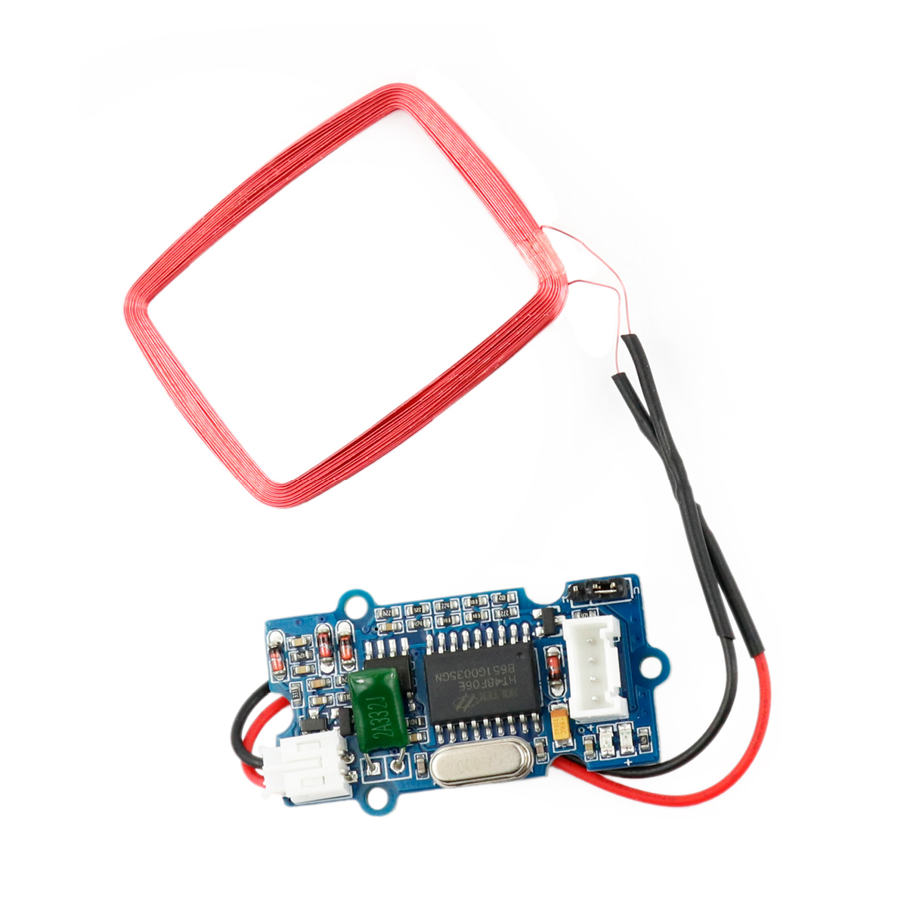

---
title: "RFID-Leser"
date: "2018-10-01T14:44:10.000Z"
tags: 
  - "sensor"
coverImage: "52_rfid_leser.jpg"
material_number: "52"
material_type: "sensor"
material_short_descr: "Seeed Studio Grove – 125KHz RFID Reader"
manufacture: "Seeed Studio"
manufacture_url: "https://www.seeedstudio.com/"
repo_name: "mks-SeeedStudio-Grove_125KHz_RFID_Reader_v1.0"
repo_prefix: "mks"
repo_manufacture: "SeeedStudio"
repo_part: "Grove_125KHz_RFID_Reader_v1.0"
product_url: "https://wiki.seeedstudio.com/Grove-125KHz_RFID_Reader/"
clone_url: "https://github.com/Make-Your-School/mks-SeeedStudio-Grove_125KHz_RFID_Reader_v1.0.git"
embedded_example_file: "examples/Grove_125KHz_RFID_Reader_v1.0_minimal/Grove_125KHz_RFID_Reader_v1.0_minimal.ino"
---

# RFID-Leser

## Beschreibung
RFID bezeichnet ein Sender-Empfänger-System, das vor allem zur eindeutigen Identifizierung von Objekten, Einkaufswaren oder auch Lebewesen eingesetzt wird. Der RFID-Transponder besitzt eine eindeutige Identifikationsnummer. Das Lesegerät liest diese aus, sobald der Transponder in unmittelbarer Nähe ist. Der Transponder benötigt dabei keine Stromversorgung, da das Auslesegerät ihn kontaktlost mit Energie versorgt.

Der RFID-Leser lässt sich direkt oder mithilfe des Grove Shields an einen Arduino oder Raspberry Pi über die serielle Schnittstelle UARTanschließen.

Mit der RFID-Technologie lässt sich beispielsweise ein Haustür-Schloss automatisieren. Individuelle RFID-Transponder müssen dann an das entsprechende Lesegerät gehalten werden und könnten so einen Schlüssel ersetzen. Bei Verlust eines Transponders ließe sich dieser nachträglich ohne Austausch des Schlosses aus dem System sperren.

Alle weiteren Hintergrundinformationen sowie ein Beispielaufbau und alle notwendigen Programmbibliotheken sind auf dem offiziellen Wiki (bisher nur in englischer Sprache) von Seeed Studio zusammengefasst. Zusätzlich findet man über alle gängigen Suchmaschinen meist nur mit der Eingabe der genauen Komponenten-Bezeichnungen entsprechende Projektbeispiele und Tutorials.

<!-- infolist -->

<!-- infolists -->
 

https://www.youtube.com/watch?v=dJXTgtIMUPw

 

## Wichtige Links für die ersten Schritte:

- [Seeed Studio Wiki - RFID Lesegerät](http://wiki.seeedstudio.com/Grove-125KHz_RFID_Reader/)
- [Produktseite - RFID Chip](https://www.seeedstudio.com/rfid-tag-combo-125khz-5-pcs-p-700.html?cPath=19_24)

## Projektbeispiele:

- [Hackster - Haus-Sicherheitssystem](https://www.hackster.io/ArduinoBasics/arduino-based-security-project-using-cayenne-eb379b)

## Weiterführende Hintergrundinformationen:

- [Arduino Tutorial - RFID, Tronixstuff (englisch)](https://tronixstuff.com/2013/11/19/arduino-tutorials-chapter-15-rfid/)
- [I2C - Wikipedia Artikel](https://de.wikipedia.org/wiki/I%C2%B2C)
- [SPI - Wikipedia Artikel](https://de.wikipedia.org/wiki/Serial_Peripheral_Interface)
- [UART - Wikipedia Artikel](https://de.wikipedia.org/wiki/Universal_Asynchronous_Receiver_Transmitter)
- [RFID - Wikipedia Artikel](https://de.wikipedia.org/wiki/RFID)
- [GitHub-Repository: RFID-Leser](https://github.com/MakeYourSchool/52-RFID-Leser)

