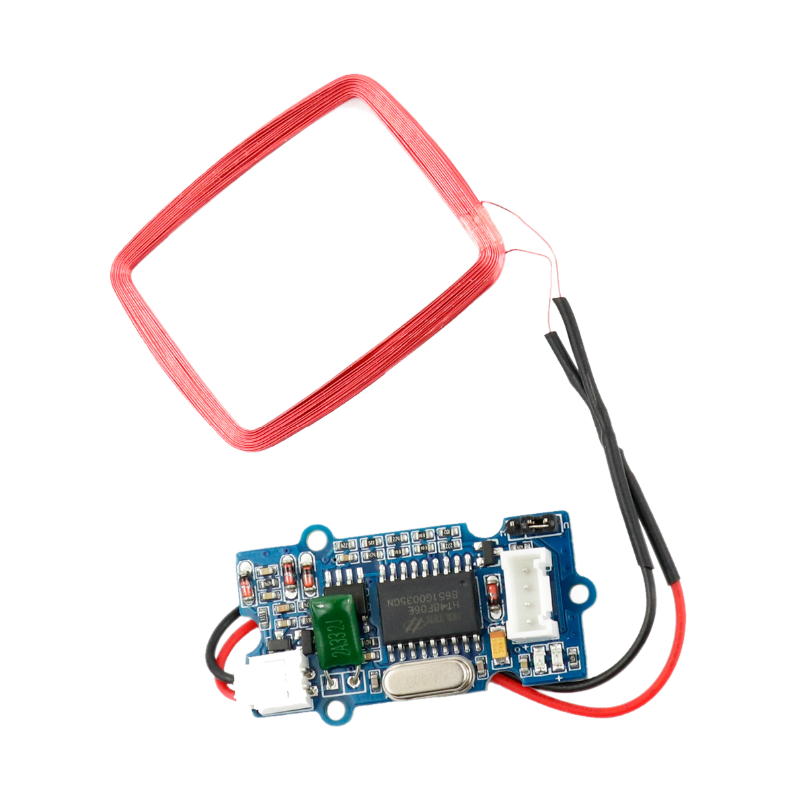

# RFID-Leser



## Beschreibung

RFID bezeichnet ein Sender-Empfänger-System, das vor allem zur eindeutigen Identifizierung von Objekten, Einkaufswaren oder auch Lebewesen eingesetzt wird. Der RFID-Transponder besitzt eine eindeutige Identifikationsnummer. Das Lesegerät liest diese aus, sobald der Transponder in unmittelbarer Nähe ist. Der Transponder benötigt dabei keine Stromversorgung, da das Auslesegerät ihn kontaktlost mit Energie versorgt.

<!-- more_details -->

Der RFID-Leser lässt sich direkt oder mithilfe des Grove Shields an einen Arduino oder Raspberry Pi über die serielle Schnittstelle UARTanschließen.

Mit der RFID-Technologie lässt sich beispielsweise ein Haustür-Schloss automatisieren. 
Individuelle RFID-Transponder müssen dann an das entsprechende Lesegerät gehalten werden und könnten so einen Schlüssel ersetzen. 
Bei Verlust eines Transponders ließe sich dieser nachträglich ohne Austausch des Schlosses aus dem System sperren.

Schaue dir die Beispiele im Ordner [`examples`](./examples/) an.
Dort haben wir verschiedene Szenarien hinterlegt.

Alle weiteren Hintergrundinformationen sowie ein Beispielaufbau und alle notwendigen Programmbibliotheken sind auf dem offiziellen Wiki (bisher nur in englischer Sprache) von Seeed Studio zusammengefasst.
Zusätzlich findet man über alle gängigen Suchmaschinen meist nur mit der Eingabe der genauen Komponenten-Bezeichnungen entsprechende Projektbeispiele und Tutorials.


https://www.youtube.com/watch?v=dJXTgtIMUPw


## Anschlüsse

### Eingang

- UART

### Ausgang

- 125kHz RFID

## Kurz-Datenblatt

- Signal Eingang: 5V
- Betriebsspannung: 5V
- Auslese Abstand (maximal): 70mm
- TTL Output 9600 baudrate, 8 data bits, 1 stop bit, and no verify bit
- Wiegand Output 26 bits Wiegand format, 1 even verify bit, 24 data bits, and 1 odd verify bit
- Chip [`RDM630`](http://www.datarfid.com/product/showproduct.php?id=14) ([Datenblatt](https://github.com/SeeedDocument/125Khz_RFID_module-UART/blob/master/res/RDM630-Spec.pdf))
- Lesbare Karten Typen:  EM4100, TK4200, EM4200


## library

Um dieses Bauteil zu verwenden, wird lediglich die Bibliothek "SoftwareSerial" benötigt.
(diese ist schon fest in die Arduino IDE integriert - du musst nichts installieren.)

## Beispiel

Der Beispiel-Code ist (vorerst) im Ordner "examples" zu finden.

```c++:./examples/GroveSerialBluetoothV3.0_minimal/GroveSerialBluetoothV3.0_minimal.ino
./examples/GroveSerialBluetoothV3.0_minimal/GroveSerialBluetoothV3.0_minimal.ino
```

<!-- TODO:  include example *_minimal.ino-->

## Anleitung


### Grundsätzlich:

- RFID-Modul am Arduino anschließen (am besten über das Grove Shield).
  Den richtigen Port entnehmt ihr dem Beispiel-Code
- Sobald der Arduino mit Strom versorgt wird, sollte das RFID-Modul rot blinken wenn du eine Karte an die Antenne hältst.

### Video

<iframe width="560" height="315" src="https://www.youtube-nocookie.com/embed/dJXTgtIMUPw?si=BcOwoU9WhtPMKLse" title="YouTube video player" frameborder="0" allow="accelerometer; autoplay; clipboard-write; encrypted-media; gyroscope; picture-in-picture; web-share" referrerpolicy="strict-origin-when-cross-origin" allowfullscreen></iframe>

## Siehe Auch

- [Seeed Studio Wiki – RFID Reader](https://wiki.seeedstudio.com/Grove-125KHz_RFID_Reader/)

## Projektbeispiele

- [Hackster – Haus-Sicherheitssystem](https://www.hackster.io/ArduinoBasics/arduino-based-security-project-using-cayenne-eb379b)

## Weiterführende Hintergrundinformationen

- [UART – Wikipedia Artikel](https://de.wikipedia.org/wiki/Universal_Asynchronous_Receiver_Transmitter)
- [RFID – Wikipedia Artikel](https://de.wikipedia.org/wiki/RFID)
